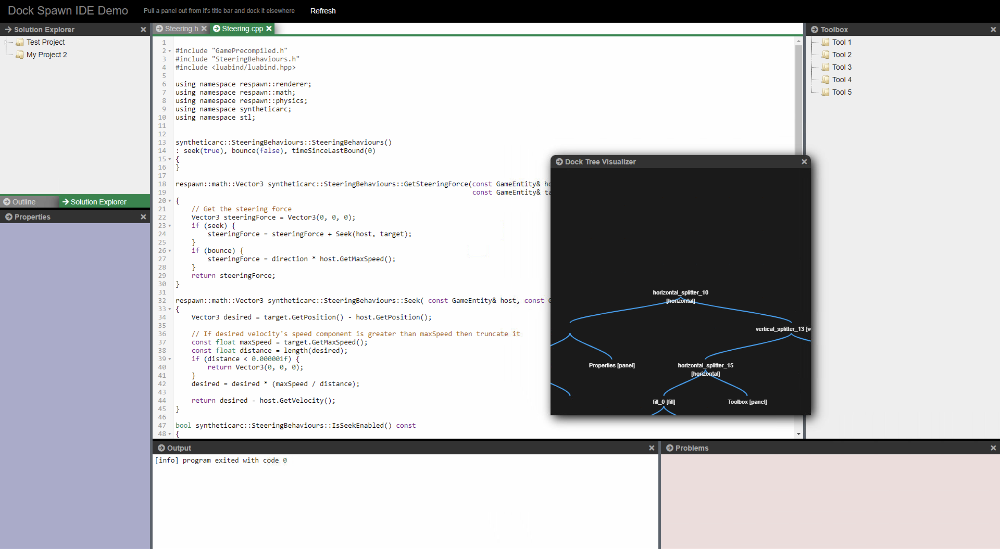

# dock-spawn-ts
A TypeScript Version of dock-spawn (see https://github.com/coderespawn/dock-spawn)

Hompage at https://node-projects.github.io/dock-spawn-ts/

[](https://www.npmjs.com/package/dock-spawn-ts)
[](https://www.npmjs.com/package/dock-spawn-ts)

# info


# differences to original docksapwn
 - typescript
 - bugfixes / preformance optimations
 - save/restore fixed and saveing/restoring of dialogs
 - touch support (works on ipad/iphone and android devices)
 - performance fixes (unnessecary removeing and adding to dom reduced, not needed elements are hidden, not removed from dom)
 - multiple dockspawn's in one page
 - removed font-awesome dependency
 - settings (dockManger.config)

# testing
 - download the project
 - install node packages ("npm i")
 - compile typescript ("npm run tsc") (compiled version is included in repo for live demo)
 - run ("npm start")
 - browse to: http://127.0.0.1:8080/demos/ide/demo.html

# how to use:

```html
   dockspawn div container needs position absolute or relative 

<div id="dock_div" style="height: calc(100% - 45px);">
    <div id="my_dock_manager" class="my-dock-manager" style="position: relative;"></div>
    <div id="solution_window" data-panel-caption="Solution Explorer" data-panel-icon="test.png" class="solution-window" hidden></div>
    <div id="properties_window" data-panel-caption="Properties" class="properties-window" hidden></div>
    <div id="problems_window" data-panel-caption="Problems" class="problems-window" hidden></div>
    <div id="editor1_window" data-panel-caption="Steering.h" class="editor1-window editor-host" hidden></div>
    <div id="editor2_window" data-panel-caption="Steering.cpp" class="editor2-window editor-host" hidden></div>
    <div id="infovis" data-panel-caption="Dock Tree Visualizer" class="editor2-window editor-host" hidden></div>
    <div id="output_window" data-panel-caption="Output" class="output-window editor-host" hidden></div>
    <div id="outline_window" data-panel-caption="Outline" class="outline-window" hidden></div>
    <div id="toolbox_window" data-panel-caption="Toolbox" class="toolbox-window" hidden></div>
</div>

```

```javascript
    import { DockManager } from "../DockManager.js";
    import { PanelContainer } from "../PanelContainer.js";

    // Convert a div to a dock manager.  Panels can then be docked on to it
    let dockManager = new DockManager(document.getElementById('my_dock_manager'));
    dockManager.initialize();

    // Let the dock manager element fill in the entire screen
    window.onresize = function () {
        dockManager.resize(
            window.innerWidth - (divDockManager.clientLeft + divDockManager.offsetLeft),
            window.innerHeight - (divDockManager.clientTop + divDockManager.offsetTop)
        );
    };
    window.onresize(null);

    // Convert existing elements on the page into "Panels". 
    // They can then be docked on to the dock manager 
    // Panels get a titlebar and a close button, and can also be 
    // converted to a floatingdialog box which can be dragged / resized 
    let solution = new PanelContainer(document.getElementById("#solution_window"), dockManager);
    let output = new PanelContainer(document.getElementById("#output_window"), dockManager);
    let properties = new PanelContainer(document.getElementById("#properties_window"), dockManager);
    let toolbox = new PanelContainer(document.getElementById("#toolbox_window"), dockManager);
    let outline = new PanelContainer(document.getElementById("#outline_window"), dockManager);
    let problems = new PanelContainer(document.getElementById("#problems_window"), dockManager);
    let editor1 = new PanelContainer(document.getElementById("#editor1_window"), dockManager);
    let editor2 = new PanelContainer(document.getElementById("#editor2_window"), dockManager);
    let infovis = new PanelContainer(document.getElementById("infovis"), dockManager);

    // Dock the panels on the dock manager
    let documentNode = dockManager.context.model.documentManagerNode;
    let solutionNode = dockManager.dockLeft(documentNode, solution, 0.20);
    let outlineNode = dockManager.dockFill(solutionNode, outline);
    let propertiesNode = dockManager.dockDown(outlineNode, properties, 0.6);
    let outputNode = dockManager.dockDown(documentNode, output, 0.4);
    let problemsNode = dockManager.dockRight(outputNode, problems, 0.40);
    let toolboxNode = dockManager.dockRight(documentNode, toolbox, 0.20);
    let editor1Node = dockManager.dockFill(documentNode, editor1);
    let editor2Node = dockManager.dockFill(documentNode, editor2);
    dockManager.floatDialog(infovis, 50, 50);

    // You could listen to callbacks of DockManager like this, there are more event's then close available see ILayoutEventListener
      dockManager.addLayoutListener({
         onClosePanel: (dockManager, panel) => {
            console.log('onClosePanel: ', dockManager, panel);
            localStorage.setItem(storeKey, dockManager.saveState());
        }
    });
```
